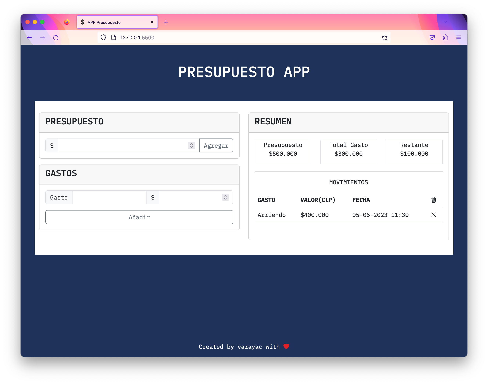

# PRUEBA FINAL MODULO 3

## Proyecto 🚀

Este proyecto corresponde a la prueba final del modulo 3, para el bootcamp **"Desarrollo de Aplicaciones Full Stack JavaScript Trainee V2.0 Vespertino"**

## Ejercicio Propuesto

Crear una aplicación de presupuesto llamada: "Presupuesto App". El objetivo de este programa es ayudar a tus usuarios a administrar sus finanzas, de una forma que sea sencilla de visualizar. Ten en cuenta que en este desarrollo se requiere que uses al menos una vez, los siguientes aspectos de JavaScript que has aprendido a lo largo del modulo 3. Puedes incluir cada aspecto como desees, pero trata de usarlos lo más óptimo que puedas para crear esta aplicación.

-   Operaciones aritméticas.
-   Condicionales if.
-   Bucle for.
-   Arreglos.
-   Métodos de Arreglos.
-   Funciones de Flecha.
-   Declaración de variables ES6.
-   Objetos Literales.

## Procedimiento 📋

1. Se crea interface responsiva y se utilizan etiquetas semanticas. ✅
2. Se modularizan los archivos correspondientes al maquetado, diseño y logica. ✅
3. Se utiliza en lo posible buenas practicas de desarrollo con JavaScript ES6 ✅
4. Se realiza entrega de proyecto en plataforma interna.

## Recursos 📌

En este proyecto se utilizó JavaScript ES6, HTML5, CSS3, Bootstrapt 5.3 y lo enseñado en el M3.
Adicionalmente se utilizaron recursos externos:

-   Google Fonts
-   Bootstrapt Icons
-   Generador de gradientes

---

Codeado(⌨️) con ❤️ por **Víctor Araya**
